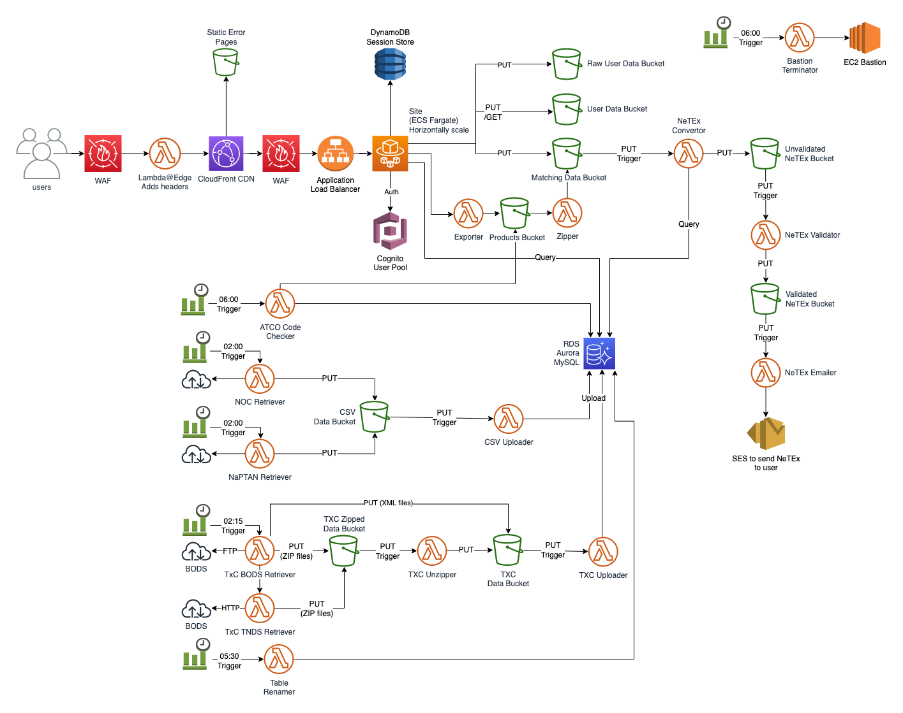

# Create Data

## Overview

This repo contains all the components of for the Create Fares Data Service.

## Architecture

## Components

* [Exporter](./repos/Exporter/README.md)
* [FDBT-Admin](./repos/FDBT-Admin/README.md)
* [FDBT-AWS](./FDBT-AWS/README.md)
* [FDBT-Dev](./FDBT-Dev/README.md)
* [FDBT-NeTEX-Output](./repos/FDBT-NeTEX-Output/README.md)
* [FDBT-Reference-Data-Service](./repos/FDBT-Reference-Data-Service/README.md)
* [FDBT-Site](./repos/FDBT-Site/README.md)
* [FDBT-Types](./repos/FDBT-Types/README.md)
