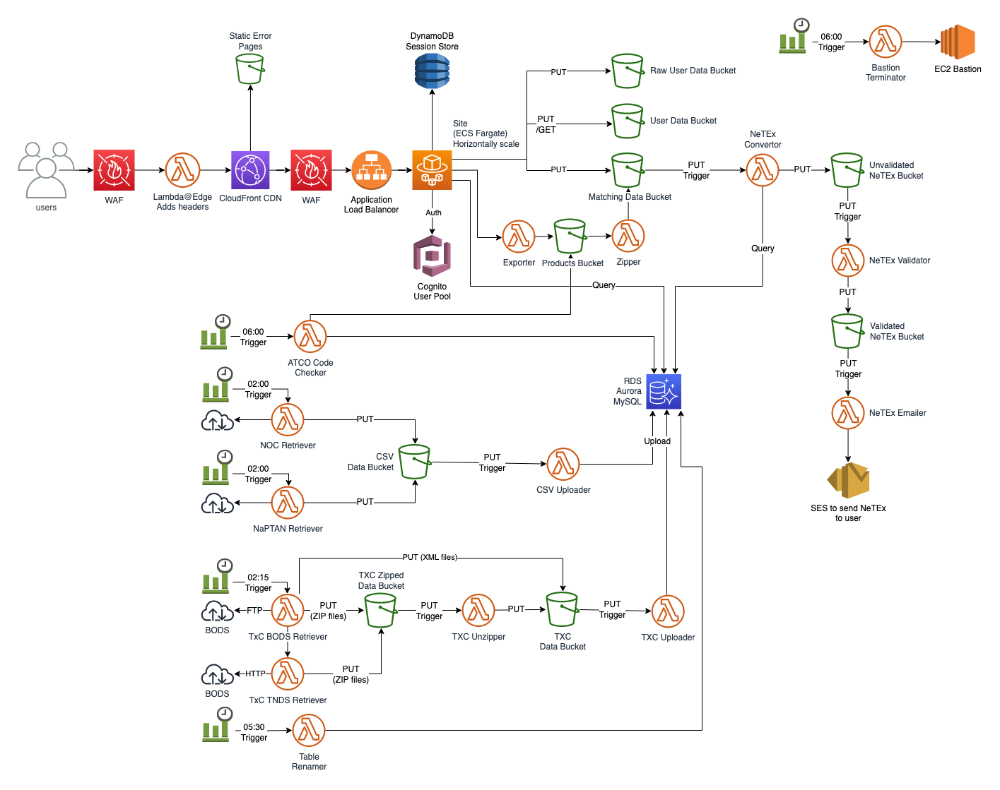

# Create Data

## Overview

This repo contains all the components of for the Create Fares Data Service.

## Documentation

- [Concepts](./docs/concepts) - High level designs, technical decisions and information
- [Guides](./docs/guides) - How to achieve specific tasks
- [How To](./docs/how-to) - Common step by step actions
- [Reference](./docs/reference) - Specifications and details
- [Troubleshooting](./docs/troubleshooting) - Dealing with issues and errors

## Architecture

## Components

- [Exporter](./repos/exporter/README.md)
- [FDBT-Admin](./repos/fdbt-admin/README.md)
- [FDBT-AWS](./fdbt-aws/README.md)
- [FDBT-Dev](./fdbt-dev/README.md)
- [FDBT-NeTEX-Output](./repos/fdbt-netex-output/README.md)
- [FDBT-Multi-Operator-Emailer](./repos/fdbt-multi-operator-emailer/README.md)
- [FDBT-Reference-Data-Service](./repos/fdbt-reference-data-service/README.md)
- [FDBT-Site](./repos/fdbt-site/README.md)
- [FDBT-Types](./repos/fdbt-types/README.md)
