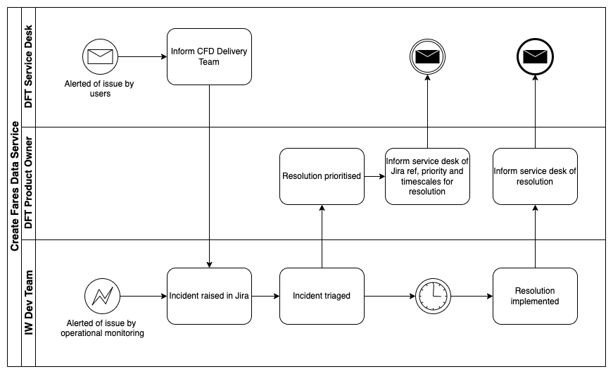

# Disaster Recovery Plan

## Description

This document delineates our policies and procedures for technology disaster recovery. Our mission is to ensure information system uptime, data integrity and availability, and business continuity.

## Team makeup and locality

The Create Fares Data team are made up of 9 roles, responsible for providing hosting and management of the Create Fares Data Service alongside 3rd line technical support during Business Hours (Mon-Fri 9-5, excluding Bank Holidays) in line with the conditions set out in the Service Management section of this page.

## Catastrophic failure scenarios and mediation (Priority 1)

| Scenario                 | Description                                                                                                                                                                      | Impact                                                                                                                            | Mitigation                                                                                                                                                                   | Monitoring                     | Proof |
| ------------------------ | -------------------------------------------------------------------------------------------------------------------------------------------------------------------------------- | --------------------------------------------------------------------------------------------------------------------------------- | ---------------------------------------------------------------------------------------------------------------------------------------------------------------------------- | ------------------------------ | ----- |
| Total loss of AWS        | The https://fares-data.dft.gov.uk/ is currently hosted within eu-west-2 AWS Region across 3 availability Zones making the likelyhood of total loss of these services negligible. | Should the entirety of eu-west-2 be lost. Our application would no longer work and customers would not be able to access the site | This risk could be mitigated if we were to host our site within another AWS Region, however having our service across 3 AZ’s is within the clients acceptable risk criteria. | https://status.aws.amazon.com/ | N/A   |
| ISP outage               | Single or multiple Create Fares Data squad members ISP’s having outages.                                                                                                         | Create Fares Data support staff would not be able to access the services required to support the application.                     | In this event, all CFD staff would be required to tether using their phones 4G to access the required services.                                                              | https://downdetector.co.uk/    |       |
| AWS account comprismised | Access to the administration of our service is through AWS IAM root/role authentication.                                                                                         | Should someone manage to maliciously access our AWS root account, they could cause total loss of the service.                     | The AWS IAM root account can only be accessed by the admin with access to the 2FA code.                                                                                      | N/A                            | N/A   |

## CFD Application Architecture

## Service Management

As detailed in the Incident Process Flow below, the Incidents shall be raised by the DfT Service Desk or the Supplier and will be given an initial priority classification by the Supplier Technical Lead based on the urgency and level of impact in accordance with the Incident priorities. The classification will be agreed with the DfT Product Owner as part of the Monthly Service Review. All Incident priority levels and durations will be reviewed at the monthly service review meeting. In the case of Priority 1 or 2 Incidents, the Supplier shall submit a Post Incident Report (PIR) within 3 working days of service restoration. The PIR shall encompass complete details of the incident including a timeline of events, actions taken to date, root cause and any actions identified to mitigate recurrence. For incidents raised outside of Business Hours, response and communication times for incidents shall begin from the start of the next business day.

| Severity Level | Description and examples                                                                                                                                                                                                |
| -------------- | ----------------------------------------------------------------------------------------------------------------------------------------------------------------------------------------------------------------------- |
| Priority 1     | Catastrophic failure of the service. Examples: Total loss of availability where users are unable to login or complete site journeys or Invalid NeTEx created for all users                                              |
| Priority 2     | Partial failure of the serviceExample: Availability of services impacted for multiple users when undertaking key customer journeysExample: Increased server response timesExample: Invalid NeTEx created for some users |
| Priority 3     | There is a minor functional issue with service but main areas remain usableThe issue impacts a small number of users, or the issue affects all users but in a minimal way                                               |
| Priority 4     | There is an issue that impacts a single user                                                                                                                                                                            |
| Priority 5     | There is a trivial issue; cosmetic or administrative in nature                                                                                                                                                          |
