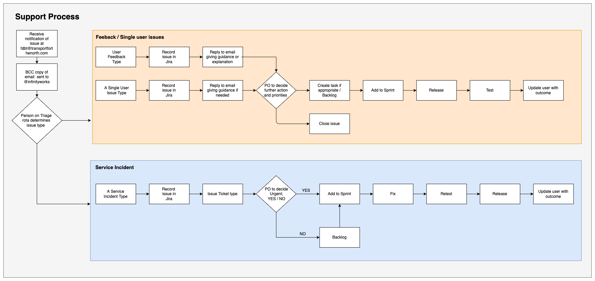

# Support Process

## Support Diagram

## Support Process and Types

1.  We receive an email notification alerting us of an issue. The email is then forwarded by BCC to IW (But a user could remove this)
2.  The person on the Triage rota will determine whether the problem is
    1. User feedback
    2. A service incident
    3. A single user issue

### 1. User Feedback Type

1.  Record issue in Jira
2.  Reply to email giving guidance or explanation if needed
3.  Product owner to make a decision and prioritise.
    Close issue if needed.
4.  Create task if appropriate / Backlog
5.  Add to sprint if appropriate
6.  Release if appropriate
7.  Test
8.  Update user with course of action

### 2. Service Incident type

1.  Record issue in Jira
2.  Issue ticket type
3.  PO to decide Urgency and priority
4.  Add to backlog or to sprint
5.  Fix
6.  Retest
7.  Release
8.  Update user with outcome

### 3. A Single User Issue Type

1.  Record issue in Jira
2.  Reply to email giving guidance or explanation if needed
3.  Product owner to prioritise
4.  Create task if appropriate
5.  Add to sprint if appropriate
6.  test if appropriate
7.  Release if appropriate
8.  Update user with course of action if appropriate
