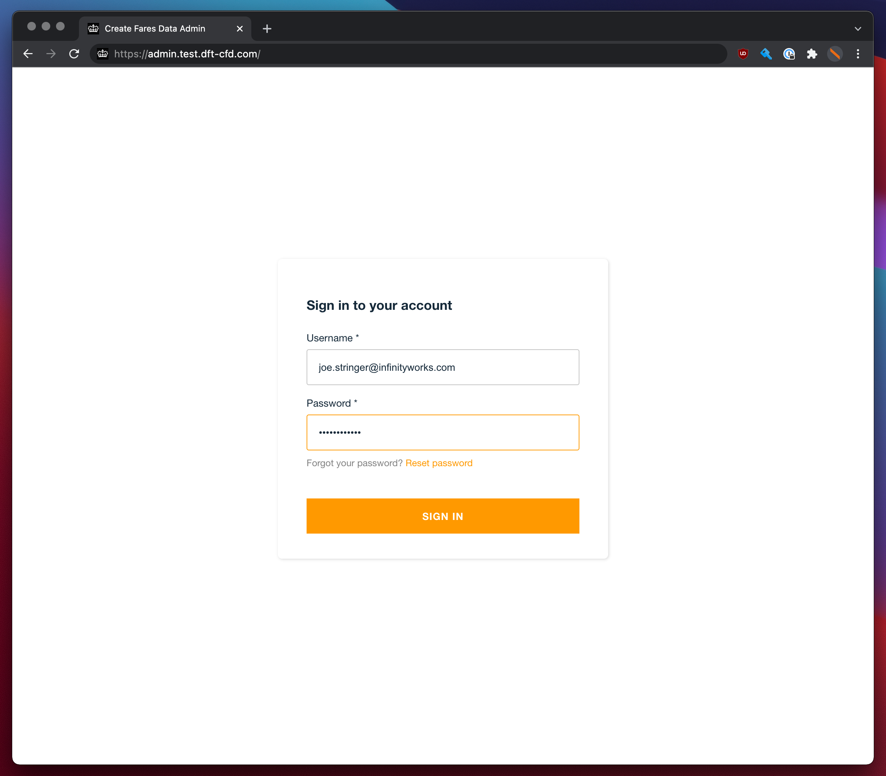
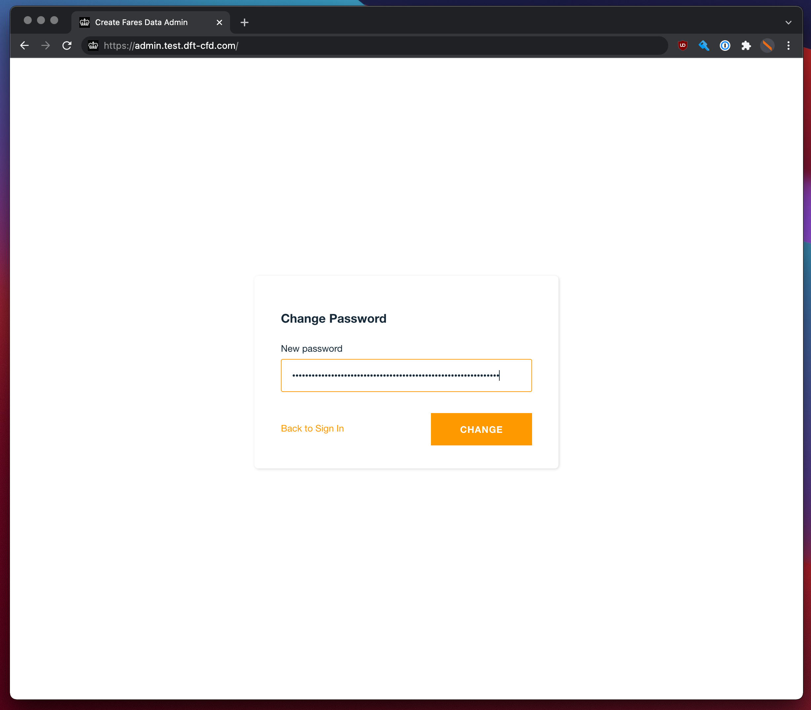
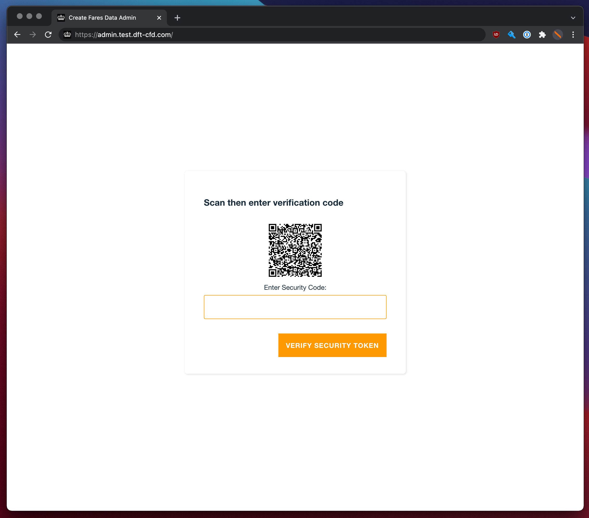
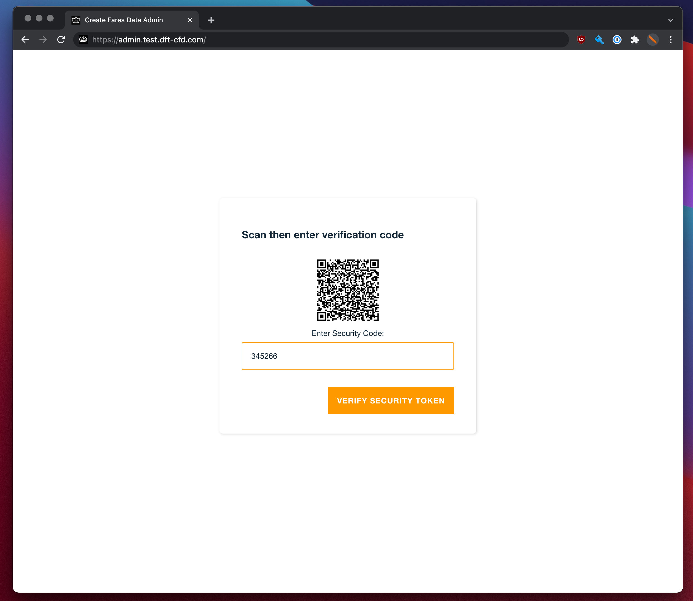

# How to Setup MFA for Create Fares Data Admin

As the CFD Admin site has the ability to grant users access to the [Fares Data](https://fares-data.dft.gov.uk) site, it is deemed an administrative site and therefore users are required to have MFA as a layer of security.

As MFA is being introduced on to the site with existing users, there will be two different journeys detailed below, the first being for a new user's first time setup including MFA and the second will be for an existing user who will be asked to add MFA to their account upon first login after MFA has been enabled.

## First time user setup with MFA

* User created in MFA console by AWS Administrator
* Email received with subject "Register for Create Fares Data Admin Panel"
* Click the link to go to the Admin site
* Login and Temporary password, provided in the email, entered

* New user created password entered

* MFA setup QR code displayed

* On a mobile device, an MFA App such as: [Microsoft Authenticator](https://www.microsoft.com/en-us/security/mobile-authenticator-app) or [Google Authenticator](https://support.google.com/accounts/answer/1066447?hl=en) need to be used to setup an MFA code
  * [How to setup an MFA code on Microsoft Authenticator](https://support.microsoft.com/en-gb/account-billing/add-your-work-or-school-account-to-the-microsoft-authenticator-app-43a73ab5-b4e8-446d-9e54-2a4cb8e4e93c)
  * [How to setup an MFA code on Google Authenticator](https://support.google.com/accounts/answer/1066447?hl=en)
* This code then needs to be entered on the page

* You now have access to the Admin Site and will need to use the MFA code every time you login

## Existing user adding MFA

* Login to the admin site as normal

* MFA setup QR code displayed

* On a mobile device, an MFA App such as: [Microsoft Authenticator](https://www.microsoft.com/en-us/security/mobile-authenticator-app) or [Google Authenticator](https://support.google.com/accounts/answer/1066447?hl=en) need to be used to setup an MFA code
  * [How to setup an MFA code on Microsoft Authenticator](https://support.microsoft.com/en-gb/account-billing/add-your-work-or-school-account-to-the-microsoft-authenticator-app-43a73ab5-b4e8-446d-9e54-2a4cb8e4e93c)
  * [How to setup an MFA code on Google Authenticator](https://support.google.com/accounts/answer/1066447?hl=en)
* This code then needs to be entered on the page

* You now have access to the Admin Site and will need to use the MFA code every time you login
