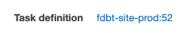

# Update environment variables

The site uses various environment variables to control certain behaviours or display certain info, these are managed in AWS ECS Fargate task definitions and the values are declared in the Fargate CloudFormation parameters. The process to update an env var depends on whether it is defined through CloudFormation or hardcoded, this can be identified by looking at the template.

## Through CloudFormation

- Navigate to the AWS console and assume role into target account (see [Access AWS](./access-aws.md))
- Navigate to CloudFormation and select the `FDBT-Fargate` stack
- Click ‘Update’ and then ‘Next’ on the ‘Use current template’ option
- On the parameters screen, update the parameter(s) that maps to the environment variable(s), click ‘Next’ and then ‘Next’ again
- On the next screen WAIT and check the changes preview before continuing, it should look like the following:

- If there are any other changes then they should be verified first so as not to make any unexpected changes
- When happy check the IAM acknowledgement box and click ‘Update stack’ which will deploy the change

## Through ECS Fargate

In the case where environment variables are hardcoded in the CloudFormation template they will need to be updated directly through the ECS Console, as an example `ENABLE_VIRUS_SCAN` is fixed to 1 but there are situations where you may want to disable it.

- Navigate to the AWS console and assume role into target account (see [Access AWS](./access-aws.md))
- Navigate to ECS console
- Select the cluster and the site service
- Click the task definition that the service is using at the top of the screen

- Click ‘Create new revision’
- Under ‘Container definitions’, select the site container
- In the panel that opens, scroll down to the ‘Environment’ section and update the desired environment variables
- Click ‘Update’ on the container definition panel, then ‘Create’ which will create a new revision of the task definition, take note of the revision number
- Navigate back to the site service and click ‘Update’
- Select the revision that was just created in the dropdown
- Click ‘Skip to review’ and then review and click ‘Update service’ to run in the change
