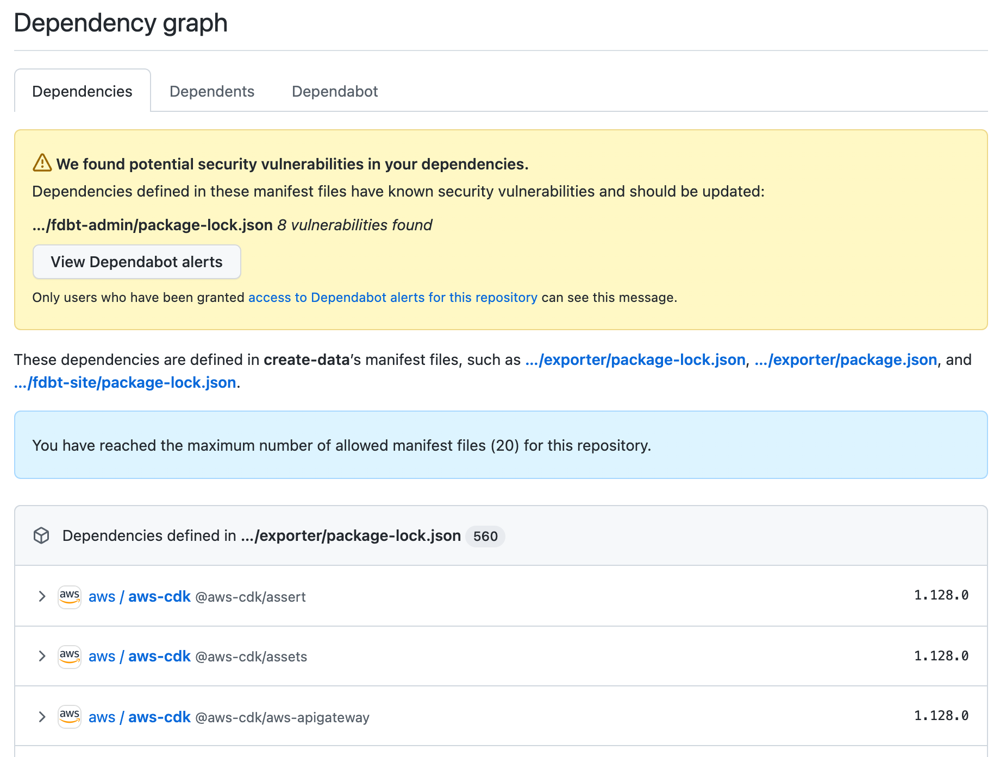

# Software Composition Analysis

## Overview

Ensuring we are keeping the dependencies of our applications is aided by the use of tooling integrated with our Github repository.

These tools provide information and scanning of our committed code as well as changes to our upstream dependencies, giving us the ability to ensure we are aware of and staying up to date with available security patches and fixes.

## Dependabot

We use Dependabot via it’s integration with our [Github Repo](https://github.com/fares-data-build-tool/create-data), it will alert via email and create pull requests for engineers to action to update outdated dependencies.

Github and Dependabot also provide a dependency graph, which gives us insight into the dependencies we are requiring throughout the application

Dependabot is configured to scan for outdated packages in both our Javascript/Typescript and Python Applications and will raise alerts on it’s findings

## Snyk - Under Evaluation

Snyk is being evaluated to complement Dependabot, providing additional visibility, information and scanning of our application dependencies. It can be integrated into our repository and build pipelines to give immediate feedback to engineers to potential security issues.
