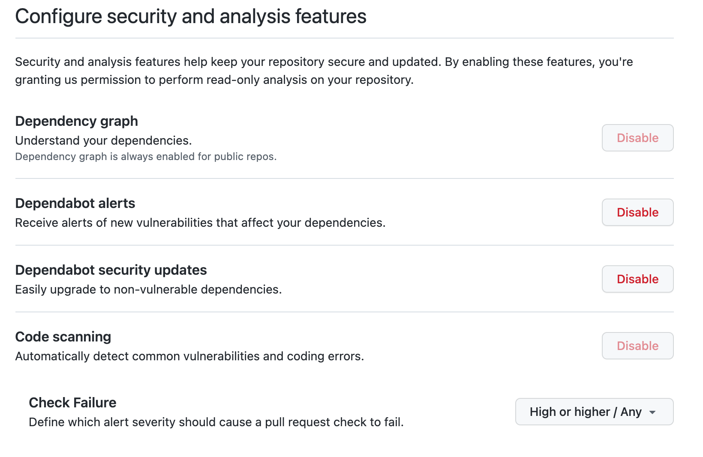

# Static Code Analysis

## Overview

Ensuring we are keeping to good security practise in our applications is aided by the use of tooling integrated with our Github repository.

These tools provide information and scanning of our committed code as well as changes to our upstream dependencies, giving us the ability to ensure we are aware of and staying up to date with available security patches and fixes.

## Github CodeQL

We use CodeQL via it’s integration with our [Github Repo](https://github.com/fares-data-build-tool/create-data), it will notify engineers as part of the Pull Request process to potential issue and findings it discovers.

CodeQL will raise notifications and comments on a Pull Request highlighting engineers to a found issue

This then marks the PR as unmergeable, requiring the CodeQL found issue to either be ignored (in the case of false positives) or a fix commit adding to the branch (where CodeQL will rescan all the changes and find that the originally raised issue has been resolved)

## Snyk - Under Evaluation

Snyk is being evaluated to complement CodeQL, providing additional visibility, information and scanning of our application code. It can be integrated into our repository and build pipelines to give immediate feedback to engineers to potential security issues.
